# How to setup Rails on Windows 10 for remote development

## Introduction

This  repo is meant to help Windows 10 users set up their develpment environment
to develop Ruby on Rails applications. This guide touches, among others, on:

<ol type="i">
 <li><a href=#setting-up-wsl2-on-windows-10>
 WSL 2 (Windows Subsystem for Linux)</a></li>
 <li><a href=#setting-up-ruby-on-rails>Setting up Ruby and Rails</a></li>
 <li><a href=#setting-up-vscode-for-local-development>Setting up VSCode for local development</a></li>
 <li>Setting up VSCode for local/remote development using SSH</li>
</ol>

## Setting up WSL2 on Windows 10

Reference: [Install WSL 2 | Microsoft](https://docs.microsoft.com/en-us/windows/wsl/wsl2-install)

The first thing you want to do is make sure your Windows 10 version and
build are compatible with WSL2 -- *As of April 3, 2020, version 1909,
build 18363.720 is **not** compatible with WSL. This is the standard
widely distributed version at the moment*

If by the time you're reading this your windows version is lower than
version 2004, build 19041.153, then you will most likely have to
get into the Windows Insider program to get Windows preview builds,
more information [on this page](https://insider.windows.com/en-us/).

>You can check your windows version by typing `winver` on the start menu

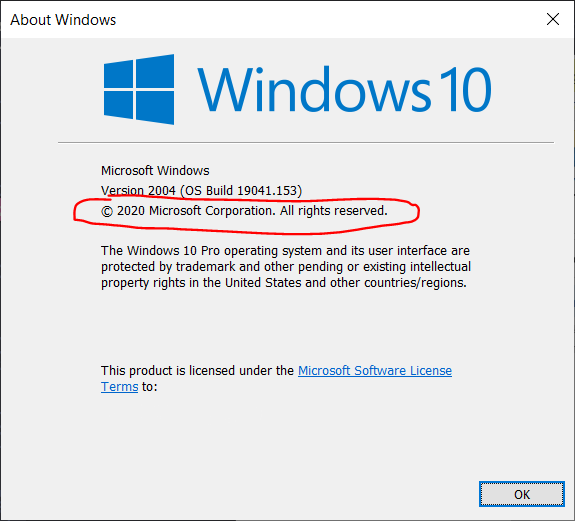

### Getting into the Insider Program

If you're not yet in the insider program, you can visit the
following link for very detailed instructions on how to
enroll into Insider Program, and install WSL 2:

> [Official Microsoft's WSL2 Installation Instructions](https://docs.microsoft.com/en-us/windows/wsl/wsl2-install)
>
> [How to install Windows Subsystem for Linux 2 on Windows 10](https://pureinfotech.com/install-windows-subsystem-linux-2-windows-10/)
>
> *Note: These guides includes WSL2 installation too*

 If you want the short version, go to Settings > Update
& Security > Windows Insider Program. There, make sure to get onto the
**SLOW ring**. At the time this guide was first written, you don't need
 get into the Fast ring, so let's avoid unnecessary problems.

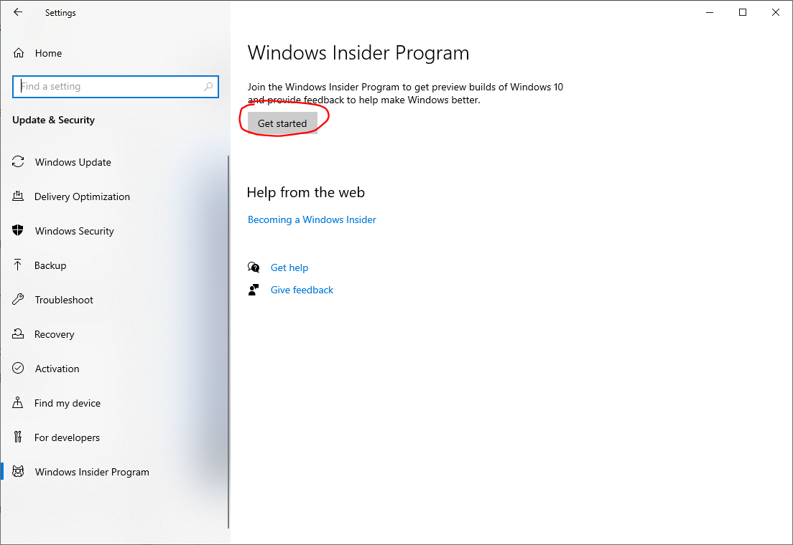

After getting into the Slow ring, restart your PC if
required. Then, check windows for updates on Settings >
Uptade & Security > Windows Update. **Once your Windows
build is above build 18917, you can continue.**

### Installing WSL2

Now that you have the right OS build, you can enable WSL2
on your computer **manually** or **via Poweshell**:

#### Powershell instructions

Open up Powershell as Admin by right clicking the Windows
start button and selecting "Windows Powershell (Admin)".
Then, paste and run the following commands and restart your computer
after they are done running:

```Powershell
dism.exe /online /enable-feature /featurename:Microsoft-Windows-Subsystem-Linux /all /norestart

dism.exe /online /enable-feature /featurename:VirtualMachinePlatform /all /norestart
```

#### Manual instructions

Go to Windows' start menu, and type "Turn Windows features
on or off". If you click in the right item, you'll see the
window below. Make sure to check "Windows Subsystem for
Linux"

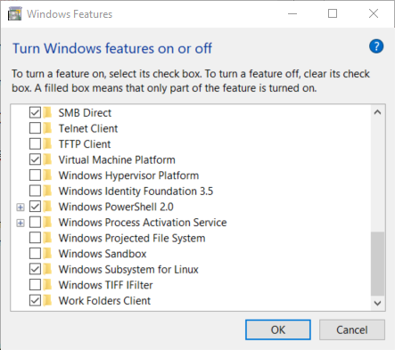

You'll probably be asked to restart your PC, please do so now.
After enabling Windows Subsystem for Linux, then we have to
install a Linux *distro* (short for distribution). Open up
the Windows Store app, and search for "Linux". You should
see something like the image below:

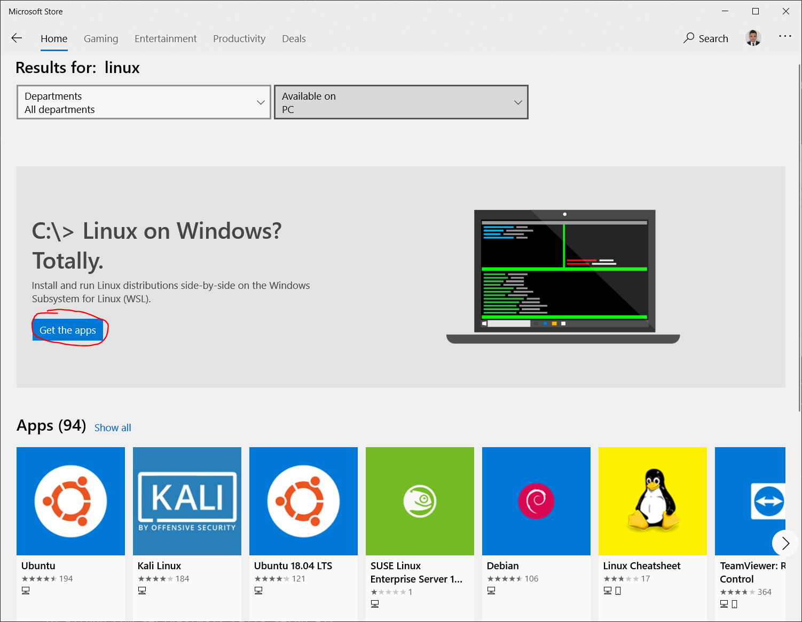

Install "Ubuntu" from the linux subpage. It will take a few
seconds. After it is installed, launch it. You will see a
*terminal* window showing the following message:

```bash
Installing, this may take a few minutes...
```

You will be asked to create a default UNIX user account.
Make sure it is a simple username (avoid mayus, symbols,
etc). Then type a password (*no characters will show
while you type, so make sure you get it right!*) and
confirm it. If everything went according to plan, you
should see the following message:

```none
Installation successful!

To run a command as administrator (user "root"), use
"sudo `<command>`".

See "man sudo_root" for details.
```

Congratulations! You are now running a virtual Linux inside
Windows 10. If anything didn't go as expected, Google the
error messages you get until everything is going as expected.
Assuming you got the right version of Windows 10 running, if you
made a mistake while installing Ubuntu, you can always just uninstall
from the Windows Store and try again. This will reset (almost)
everything related to that Linux distro, so if you seriously mess up,
you can always reset.

#### Making sure WSL version 2 is running

If you still have your Ubuntu *bash* terminal open, close it (*pro tip:
type `exit` instead of clicking the X arrow. Get used to the CLI -
Command Line Interface*). Open Powershell and type

```Powershell
wsl -l -v
```

You should see something like this:

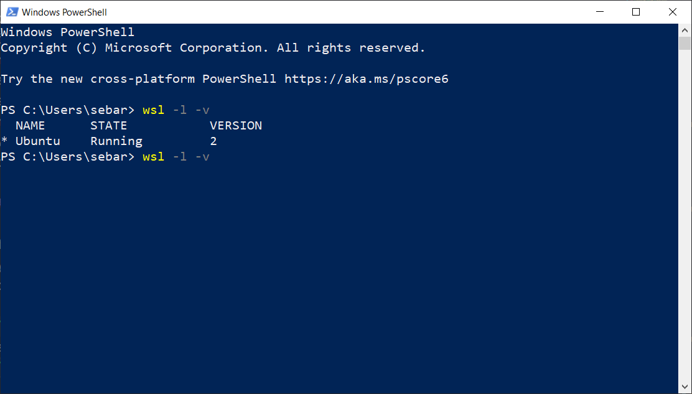

If your distro's version is NOT 2, then you definitely have to run the
command below. If it is 2, you should run it anyways just in case:

```Powershell
wsl --set-version <Distro> 2
```

Where `<Distro>` is your distro's name from the list (mine is "Ubuntu").
You will see online that some people have other names (like Ubuntu 18.04),
don't worry about that for now. If successful, you should see the following
message:

```none
Conversion in progress, this may take a few minutes...

For information on the key differences with WSL 2 please visit <https://aka.ms/wsl2>
```

Then, run the following command so every next instance is WSL 2 too:

```Powershell
wsl --set-default-version 2
```

Run the `wsl -l -v` command again and make sure you got version 2 now. If
everything went well, you have finished the WSL 2 setup part.

## Setting up Ruby on Rails

Now you have to update your Linux distro and set up Rails. For detailed and
up-to-date instructions, you can visit [Rails Installation Tutorial](https://gorails.com/setup/windows/10#ruby);
I recommend that you follow the steps outlined in this site and select all
recommended options and don't skip any steps! You will need everyhing done
here at some point or another. Most of the guide works, although some parts
may not work for you as time passes and different packages get updated. **For
instance, at this time, the installation instruction for PostgreSQL from
the tutorial above doesn't work** (I show how to do this below).

> **Tip:** when pasting lines of code into your Ubuntu bash terminal, CTRL+V
> won't work, but if you right-click the terminal it will paste the content
> from your clipboard.

> **Tip 2:** If this is your first time using the terminal, it's best if you
> paste commands 1 line at a time. Multi-line should work, but you may make
> mistakes as sometimes the last line doesn't run automatically.

<br>
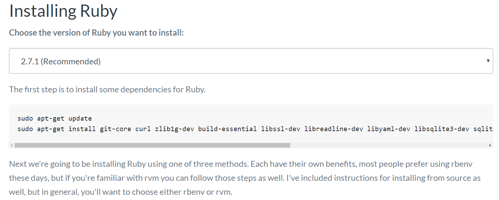<br>
&nbsp;*GoRails tutorial example*
<br>

As you follow the steps above, make sure to read the return messages from
the terminal. If there's anything funky or you get an error message, stop
and debug it! The order in which things are done makes a big difference.

Just in case the guide above changes, I will show the instructions for Ruby
version 2.7.1 and Rails version 6.0.2.2 below, with some handy tips for
beginners.

### Installing Ruby and Updating your Distro

Ruby is the backend language that powers Rails apps. This means that it
controls the logic via scripts, just like Python or R. You can learn more
about this [here](https://www.ruby-lang.org/en/about/) and [here](https://ruby-lang.co/what-is-ruby/).

First, let's get your distro upgraded! In Linux speech, "update" means
getting the latest version numbers, and "upgrade" means actually downloading
and installing them. Run the following code in Ubuntu:

```bash
sudo apt update && sudo apt dist-upgrade && sudo apt-get autoremove && sudo
apt-get clean
```

If you are asked to proceed, type "Y" and hit enter

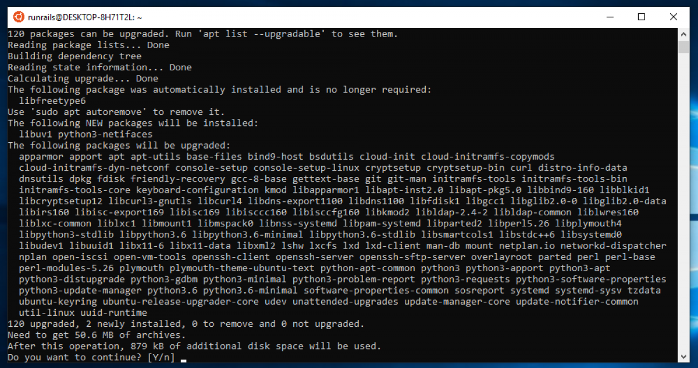

Now that your distro's libraries are up-to-date, let's proceed to install
ruby. Run the following 2 lines in your Ubuntu terminal:

```bash
sudo apt install curl
curl -sL https://deb.nodesource.com/setup_12.x | sudo -E bash -
curl -sS https://dl.yarnpkg.com/debian/pubkey.gpg | sudo apt-key add -
echo "deb https://dl.yarnpkg.com/debian/ stable main" | sudo tee /etc/apt/sources.list.d/yarn.list

sudo apt-get update

sudo apt-get install git-core zlib1g-dev build-essential libssl-dev libreadline-dev libyaml-dev libsqlite3-dev sqlite3 libxml2-dev libxslt1-dev libcurl4-openssl-dev software-properties-common libffi-dev nodejs yarn
```

That's a long code! If you are promped for your password, please input it
and press enter. This is because we invoked sudo (*pro tip: sudo won't ask
you for a password for some time after inputting it successfully*).

Now, let;s install Ruby using `rbenv`. Run the following lines in your
bash terminal (same Ubuntu window):

```bash
cd
git clone https://github.com/rbenv/rbenv.git ~/.rbenv
echo 'export PATH="$HOME/.rbenv/bin:$PATH"' >> ~/.bashrc
echo 'eval "$(rbenv init -)"' >> ~/.bashrc
exec $SHELL

git clone https://github.com/rbenv/ruby-build.git ~/.rbenv/plugins/ruby-build
echo 'export PATH="$HOME/.rbenv/plugins/ruby-build/bin:$PATH"' >> ~/.bashrc
exec $SHELL

rbenv install 2.7.1
rbenv global 2.7.1
ruby -v
```

Now let's install bundler, which is an impotant gem (ruby libary):

```bash
gem install bundler
rbenv rehash
```

### Configuring Git

If you don't already have a GitHub account, [create one now](https://github.com/join?source=header-home).
This will come very handy in the future, and some things we do here (like
creating SSH keys) will be useful outside of Git and Github, so no skipping.

After creating your Github account (or if you already had one), paste the
following commands in your terminal, replaceing the items in CAPS with your
name (use your UNIX username for simplicity) and github email:

```bash
git config --global color.ui true
git config --global user.name "YOUR NAME"
git config --global user.email "YOUR@EMAIL.com"
ssh-keygen -t rsa -b 4096 -C "YOUR@EMAIL.com"
```

When prompted for a location, just press enter. Same for password, no need
to add a password to this for now. If successful, this is a sample output:

```none
Generating public/private rsa key pair.
Enter file in which to save the key (/Users/USERNAME/.ssh/id_rsa):
Enter passphrase (empty for no passphrase):
Enter same passphrase again:
Your identification has been saved in /Users/USERNAME/.ssh/id_rsa.
Your public key has been saved in /Users/USERNAME/.ssh/id_rsa.pub.
The key fingerprint is:
80:5f:25:7c:f4:90:aa:e1:f4:a0:01:43:4e:e8:bc:f5 vivek@desktop01
The key's randomart image is:
+--[ RSA 2048]----+
| oo    ...+.     |
|.oo  .  .ooo     |
|o .o. . .o  .    |
| o ...+o.        |
|  o .=.=S        |
| .  .Eo .        |
|                 |
|                 |
|                 |
+-----------------+
```

We just generated fancy, industrial-grade security keys. This is much more
convenient and secure than using passwords (even though you would never
re-use a password, rigt?). So we'll paste the encrypted PUBLIC key into
Github, which will accept our connections in the future without the need
of a password. Get your public key by running the following command:

```bash
cat ~/.ssh/id_rsa.pub
```

This will output the contents of the "id_rsa.pub" file, which holds your
SSH public key. Once you get that output, you can select it with your
mouse and right-click it to copy it (remember, CTRL+C doesn't copy things
in the Ubuntu bash terminal).

> Note: the ~ variable is the same as typing \$HOME, which is a variable as
> indicated by the preceding dollar sign (\$). This is just a shortcut to
> indicate your user's home folder, very similar to your user folder in
> Windows 10.

The command's output should look something like this:

```none
ssh-rsa AAAAB3NzaC1yc2EAAAABIwAAAQEAklOUpkDHrfHY17SbrmTIpNLTGK9Tjom/BWDSU
GPl+nafzlHDTYW7hdI4yZ5ew18JH4JW9jbhUFrviQzM7xlELEVf4h9lFX5QVkbPppSwg0cda3
Pbv7kOdJ/MTyBlWXFCR+HAo3FXRitBqxiX1nKhXpHAZsMciLq8V6RjsNAQwdsdMFvSlVK/7XA
t3FaoJoAsncM1Q9x5+3V0Ww68/eIFmb1zuUFljQJKprrX88XypNDvjYNby6vw/Pb0rwert/En
mZ+AW4OZPnTPI89ZPmVMLuayrD2cE86Z/il8b+gw3r3+1nKatmIkjn2so1d01QraTlMqVSsbx
NrRFi9wrf+M7Q== USER@HOSTNAME
```

Now, let's head to [Github](https://github.com/settings/keys) and paste that
SSH key [in here](https://github.com/settings/ssh/new). Remember to give this
key a name so you remember it's your WSL 2 connecting to Github. Let's
double-check that everything worked out, run the following command:

```bash
ssh -T git@github.com`
```

You should see something like this:

```none
Hi USERNAME! You've successfully authenticated, but GitHub does not provide shell access.
```

Great! So now we have a) WSL 2 set up, b) an Ubuntu distro installed and
updated, c) Ruby installed, and d) an SSH key pair created and successfully
connected to Github. We're almost there.

### Installing Rails

Run the following commands in your bash terminal:

```bash
curl -sL https://deb.nodesource.com/setup_12.x | sudo -E bash -
curl -sS https://dl.yarnpkg.com/debian/pubkey.gpg | sudo apt-key add -
echo "deb https://dl.yarnpkg.com/debian/ stable main" | sudo tee /etc/apt/sources.list.d/yarn.list

sudo apt update
sudo apt-get install -y nodejs yarn
```

This may take a few minutes as you're installing NodeJS and Yarn, two very
important packages.

> *Note: you may have noticed that whenever we run the
> `apt update` or `apt-get install` commands we get more packages, and
> whenever we run `gem install` command we get more "gems" (ruby libraries)*

And now we finally install Rails (this may take a few minutes too):

```bash
gem install rails -v 6.0.2.2
rbenv rehash
```

Let's test it out by running `rails -v`, you should get:

```bash
rails -v
Rails 6.0.2.2
```

If you get anything different, start debugging/Googling.

### Installing and Configuring PostgreSQL

You can install PostgreSQL in Windows or directly in the WSL. It is easier
to install it in Windows, but I prefer separating my development environment
from my personal user space, so I'll show how to install it in your WSL.

As of April 3, 2020, installing PostgreSQL-11 isn't trivial. First, let's
go to [Postgre's website](https://www.postgresql.org/download/linux/ubuntu/).
Choose your Ubuntu apt repository (most likely Bionic 18.04) and run the
following commands from your bash terminal:

```bash
sudo vim /etc/apt/sources.list.d/pgdg.list
```

Vim is the terminal's text editor. **Don't try typing things yet!** Vim
doesn't start in "insert mode" which is the mode that lets you type stuff,
instaed it starts in the mode that accepts commands. So first push the "i"
key in your keyboard. This will take vim into "insert mode" like below:

<br>
&nbsp;*Vim in insert mode -> text editing enabled*

Now that we can insert stuff, paste the following line into the
document (remember to right-click)L

```vim
deb http://apt.postgresql.org/pub/repos/apt/ bionic-pgdg main
```

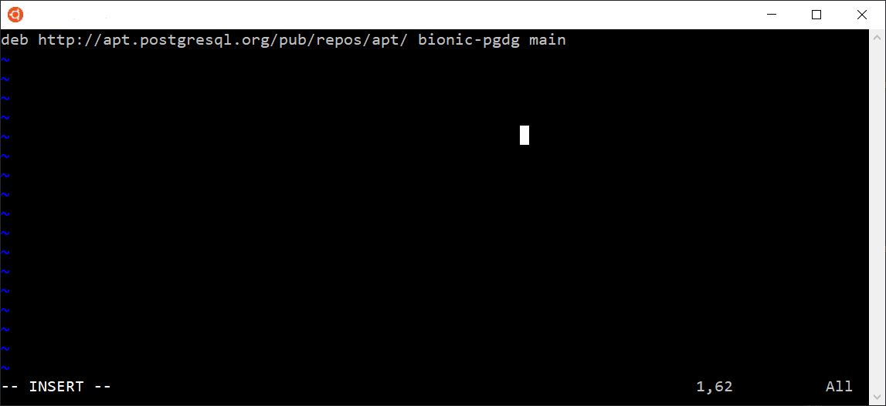

After pasting that line, we have to save and exit. To do this, first
exit INSERT mode by pressing your ESC key. You'll notice that the
-- INSERT -- message disappeared from the bottom left corter of
vim's screen. Now, type `:w` and press enter. This will ask vim
to **write** changes into the file. Then, type `:q` which will ask
vim to exit (*Note: you can also do `:wq` to do both at the same time*).

We just added the information required for bash to successfully get the
latest version of PostgreSQL. So now we'll get it! Run the following
command in bash:

```bash
wget --quiet -O - https://www.postgresql.org/media/keys/ACCC4CF8.asc | sudo apt-key add -

sudo apt-get update
```

We got the update info now, let's install:

```bash
sudo apt-get install postgresql-11

sudo apt install libpq-dev
```

Now that PostgreSQL is installed, let's set up a user. Run the code below
replacing `USERNAME` for your UNIX user for simplicity:

```bash
sudo -u postgres createuser USERNAME -s
```

And now we're done with PostgreSQL! All that's left is to test the server:

### Testing Rails server

To see whether things are working, lets boot up a server. Run the following
lines of code in your terminal:

```bash
cd
rails new helloworldapp
cd helloworldapp
rails server -b 0.0.0.0 -p 3000
```

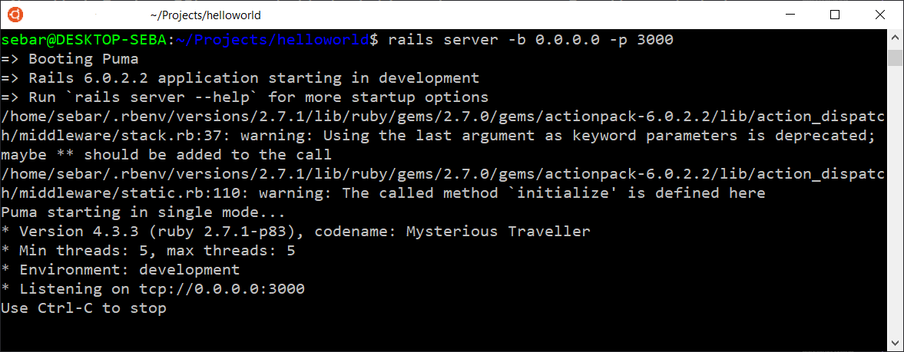<br>
&nbsp;*Puma server booted successfully*

Now, if you were able to boot up Puma successfully, you
should be able to open up Chrome or any other browser and
enter `http://localhost:3000` in the address bar. If you
did everything well, you should see the following page:

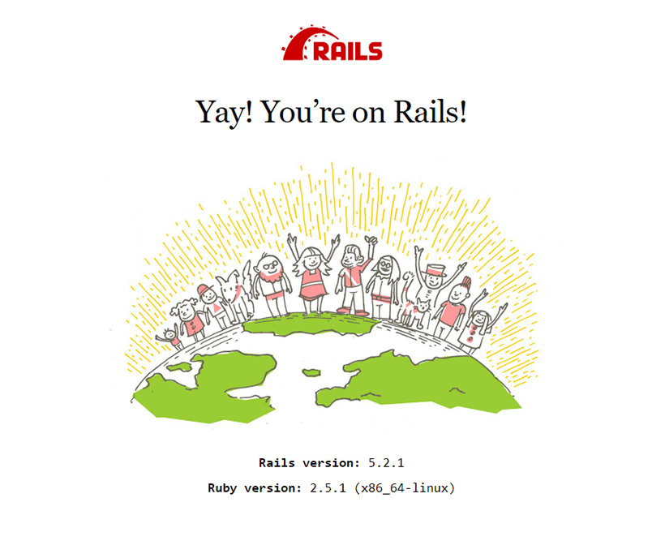

Rejoice! The hard part is over. **Now, close your server by going back to the
terminal and pressing CTRL+C**

## Setting up VSCode for Local Development

It's great that you have a server up and running, but you will most likely
want to have real-time access to the code and assets in the server. The files
that live in your Linux subsystem don't like comingling with your Windows
files (they are completely separate Operating Systems after all). *This means
that you can't really edit those files DIRECTLY from Windows*. If we left
things as they are now, you would have to make some code, upload it to
Github, and then download it using your Ubuntu terminal. This would be
cumbersome to say the least.

Fret not! Since your WSL lives inside Windows, you CAN edit the files using
Windows, but *not directly*. This means that you will be able to code and
instantly see the changes you made in the same computer.

If this sounds a bit too technical, **just follow these steps so you can
use VSCode inside your new Linux environment.**

### Download and Install VSCode

In case you don't already have VSCode, then [please download and install it
now](https://code.visualstudio.com/download) (*download the Windows 64 bit
version unless you know you have a different Operating System*). You may be
thinking about downloading the Ubuntu version, but don't. WSL 2 is *kind of*
Linux, but not full fledged, VSCode needs to run from a fully functional
Operating System like the Windows 10 you're running now.

> Make sure to leave the "Add to PATH" checkbox **TICKED**

Some resources in case something goes wrong:

[Official "Developing in WSL" guide](https://code.visualstudio.com/docs/remote/wsl)<br>
[Remote development in WSL guided tutorial](https://code.visualstudio.com/remote-tutorials/wsl/getting-started)<br>
[Remote-WSL Extension site](https://marketplace.visualstudio.com/items?itemName=ms-vscode-remote.remote-wsl)<br>
[Full guide from Microsoft](https://devblogs.microsoft.com/commandline/an-in-depth-tutorial-on-linux-development-on-windows-with-wsl-and-visual-studio-code/)<br>

### Install Remote Development Extensions

After installing, open VSCode. It will most likely offer you to install a
"Remote-WSL" extension. Don't do it for now. Go to extensions on the left
(or hit CTRL+SHIFT+X) and paste this into the search bar:

```none
Remote Development
```

You should see something like the picture below but with
the option to install available (I already have it installed
so it doesn't show up):

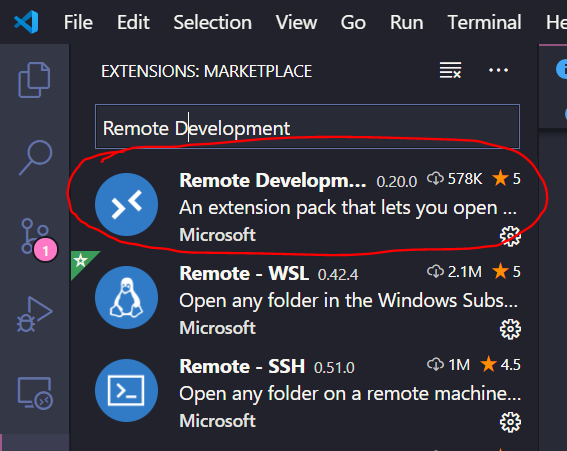

Install this one. If you installed it successfully, you should see the little
connection icon in the bottom-left corner of your VSCode:

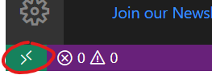

Click on that green icon. You'll notice a dropdown menu appeared near the
top of your VSCode. Click on `Remote-WSL: New Window`. Now VSCode is asking
for a folder to open. Browse to the *helloworld* app we created before to
test whether Rails was creating a server successfully. It should be something
like `/home/USERNAME/helloworld/`. Click OK. After a second, you should see
a notification  at the bottom-right corner of VSCode stating that "Code
Server" is being installed in WSL:


Once this is finished, VSCode will open up a new window and your status
at the bottom-left corner will change to `WSL: <DISTRO>` like below:


If you got all the way here, then congratulations! You can now successfully
code from your Windows 10 machine using VSCode and see those changes
reflected in real time in your server. Try it out by creating a hello-world
view inside your helloworld app!

### Test VSCode by Making Hello World View

From your `helloworld` app folder, go to `config > routes.rb` and double
click the file to open. Add the following line inside the `Rails.application.routes.draw do` block:

```ruby
 root 'application#hello'
```

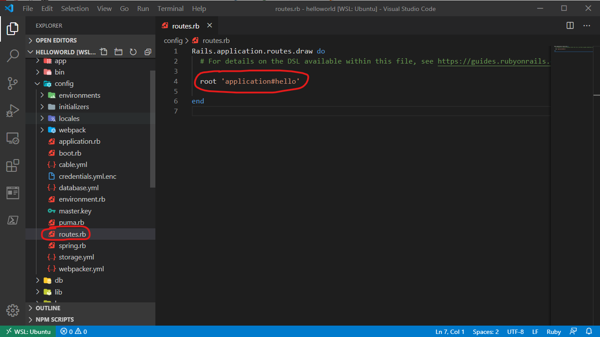

Then go to `app > controllers > application_controller.rb` and open the file.
Inside the `ApplicationController` class, add the following instance method:

```ruby
  def hello
    render html: ("<p>Hello worlddd &#x1F525;!!!<p>").html_safe
  end
```

<br>

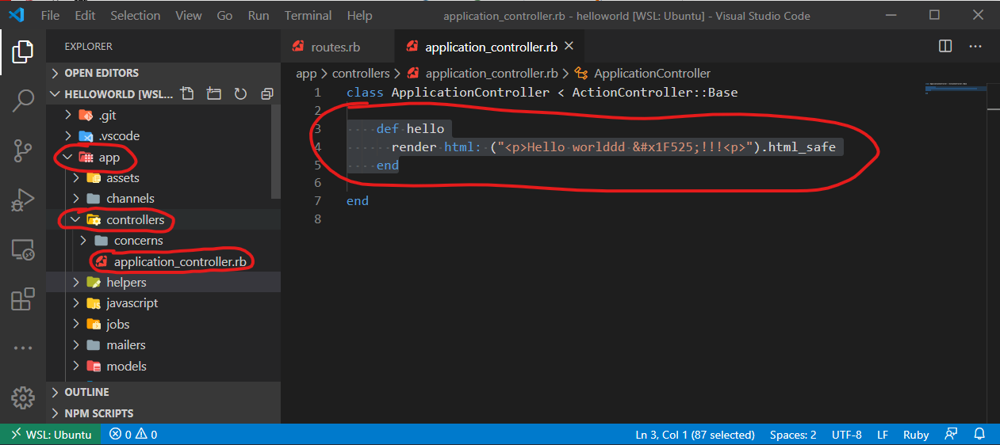

Now let's boot up the server again, and let's do it well. At the menu on the
top, click on `Terminal > New Terminal`, or better yet, press ``CTRL+SHIFT+` ``
(*" \` " is the key next to "1" in your keyboard*). 

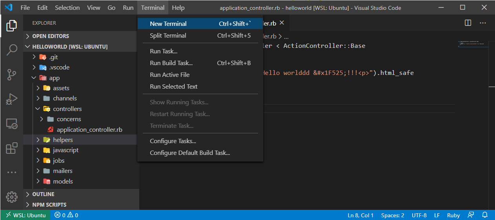

Once you open the terminal, **make sure that the commands are being run from the helloworld folder.** This can be double-checked by looking at the
terminal line:

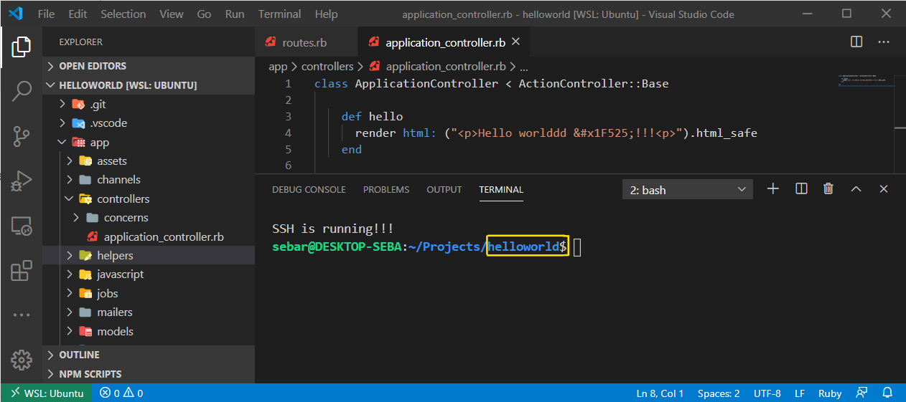

If everything is going according to plan, then type the following in this
new terminal:

```bash
rails server -b 0.0.0.0 -p 3000
```

If you have done everything well up to this point, visit <http://localhost:3000>
and you will see this:

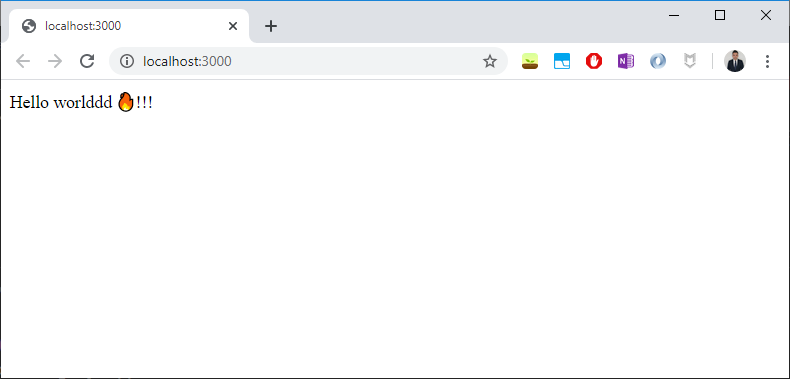

> **Don't forget to stop the server again, CTRL+C.**

Congratulations, you are now up and running with VSCode + WSL2 + Ruby on Rails.
Nothing is stopping you now.

</br></br>

TODO

* Windows terminal
* Setting up VSCode via WSL 2 connection
* Forwarding ports, making website discoverable in local
network on startup (NIC bridge)
* Allowing connection via hostname instead of IP
* Advanced: Setting up VSCode via SSH, automating SSH Daemon
on startup


<!---
powershell for linux:
https://linuxhint.com/install_powershell_ubuntu/
wget -q https://packages.microsoft.com/config/ubuntu/18.04/packages-microsoft-prod.deb

SSH:
https://code.visualstudio.com/docs/remote/ssh
https://code.visualstudio.com/docs/remote/troubleshooting#_installing-a-supported-ssh-client
https://gist.github.com/dentechy/de2be62b55cfd234681921d5a8b6be11

Ports:
https://github.com/microsoft/WSL/issues/4150#issuecomment-504209723

--->